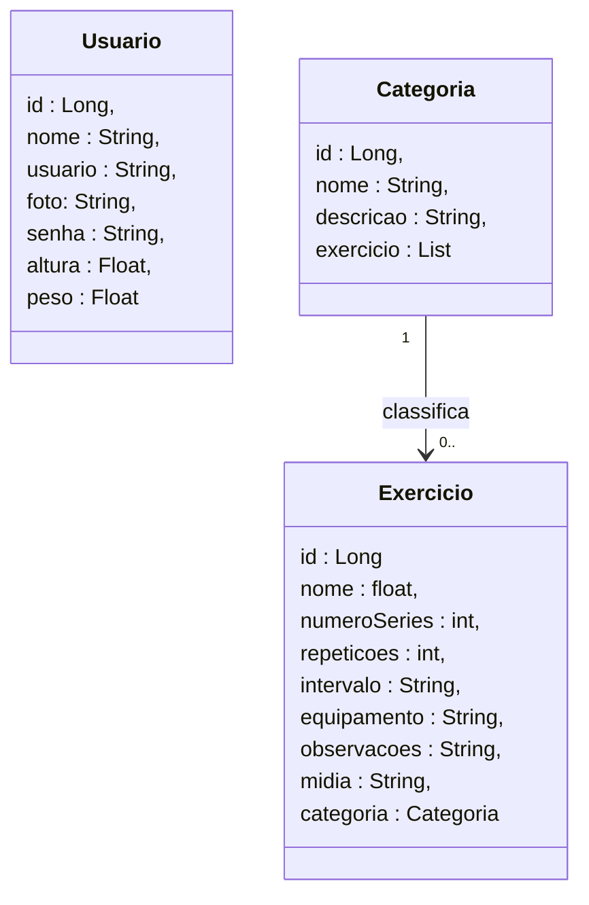
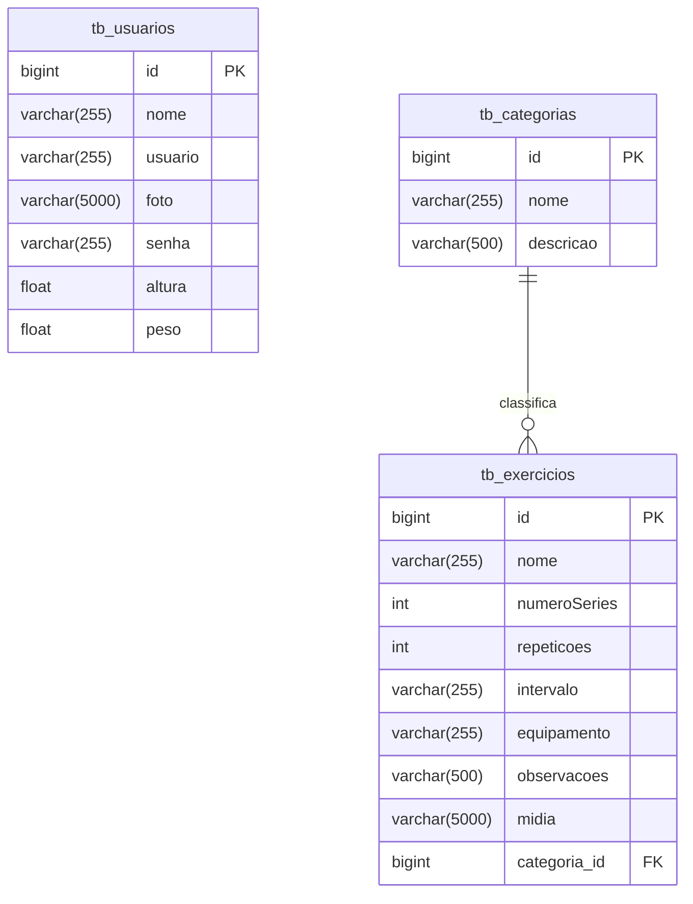

# FisioCare - Backend

<br />

<div align="center">
    
</div>

<div align="center">


 
</div>

<br /><br />

## 1. 📄 Descrição

Este projeto propõe o desenvolvimento de um serviço voltado ao gerenciamento e acompanhamento das rotinas de treino de pacientes em fisioterapia. A aplicação será estruturada para realizar operações de CRUD (Create, Read, Update, Delete) sobre as entidades centrais do sistema: usuários, exercícios e categorias. O gerenciamento eficiente desses recursos será complementado pela implementação de uma camada de segurança, visando assegurar a integridade dos dados e o controle de acesso por meio de autenticação e autorização.

### 1.1. 🛠️ Funcionalidades:

**Usuário**
1. Criar Usuário (Create): Permite o cadastro de um novo usuário no sistema, informando todos os atributos necessários.

2. Consultar Usuário(s) (Read): Consultar um usuário específico através do seu id. Listar todos os usuários cadastrados, com possibilidade de filtragem por nome ou email.

3. Atualizar Usuário (Update): Permite a modificação dos dados de um usuário já existente, identificando-o pelo id.

**Categoria**
1. Criar Categoria (Create): Permite o cadastro de uma nova categoria de exercício (ex: mobilidade, fortalecimento, alongamento), informando os atributos necessários.

2. Consultar Categoria(s) (Read): Possibilita a consulta de uma categoria específica pelo seu ID ou a listagem de todas as categorias registradas, com filtragem opcional por nome.

3. Atualizar Categoria (Update): Permite a edição dos dados de uma categoria existente, identificando-a por seu ID.

4. Excluir Categoria (Delete): Remove uma categoria do sistema, com base em seu ID.

**Exercício**
1. Criar Exercício (Create): Permite o cadastro de um novo exercício no sistema, informando atributos como nome, descrição, categoria associada e orientações de execução.

2. Consultar Exercício(s) (Read): Permite visualizar os dados de um exercício específico por meio do seu ID ou listar todos os exercícios disponíveis, com possibilidade de filtragem por nome, categoria ou tipo de movimento.

3. Atualizar Exercício (Update): Permite modificar os dados de um exercício existente, identificado por seu ID.

4. Excluir Exercício (Delete): Remove um exercício do sistema, utilizando seu ID como identificador.

------

## 2. 🖥️ Sobre esta API

A API do FisioCare foi desenvolvida utilizando Java e o framework Spring, seguindo os princípios da Arquitetura MVC e REST. Ela oferece endpoints para o gerenciamento dos recursos **Usuário**, **Categoria** e **Exercício**, permitindo a interação entre as usuárias com os dados cadastrados nessas entidades.

### 2.1. 🚀 Principais Funcionalidades

1. Consulta, criação e edição de usuários
2. Consulta, criação, edição e exclusao de Categorias
3. Consulta, criação, edição e exclusao de Exercícios

------

## 3. 📊 Diagrama de Classes

O DER (Diagrama Entidade-Relacionamento) do projeto FisioCare representa de forma visual como os dados estão organizados no banco de dados relacional e como as entidades se relacionam entre si.



------

## 4. 🗺️ Diagrama Entidade-Relacionamento (DER)




------

## 5. 🧰 Tecnologias utilizadas

| Item                          | Descrição      |
| ----------------------------- | -------------- |
| **Servidor**                  | Tomcat         |
| **Linguagem de programação**  | Java           |
| **Framework**                 | SpringBoot     |
| **ORM**                       | JPA + Hibernate|
| **Banco de dados Relacional** | MySQL          |

------

## 6. ▶️ Configuração e Execução

### 6.1 📦 Importando o Projeto

1. Clone o repositório do Projeto [FisioCare](https://github.com/Projetos-Grupo-01/fisiocare) dentro da pasta do *Workspace* do STS

```bash
https://github.com/Projetos-Grupo-01/fisiocare
```

2. **Abra o STS** e selecione a pasta do *Workspace* onde você clonou o repositório do projeto
3. No menu superior do STS, clique na opção: **File 🡲 Import...**
4. Na janela **Import**, selecione a opção: **General 🡲 Existing Projects into Workspace** e clique no botão **Next**
5. Na janela **Import Projects**, no item **Select root directory**, clique no botão **Browse...** e selecione a pasta do Workspace onde você clonou o repositório do projeto
6. O STS reconhecerá o projeto automaticamente
7. Marque o Projeto FisioCare no item **Projects** e clique no botão **Finish** para concluir a importação

<br />

### 6.2. ▶️ Executando o projeto

1. Na Guia **Boot Dashboard**, localize o  **Projeto FisioCare**
2. Selecione o **Projeto FisioCare**
3. Clique no botão **Start or Restart**  para iniciar a aplicação
4. Caso seja perguntado se você deseja autorizar o acesso ao projeto via rede, clique no botão **Permitir Acesso**
5. Acompanhe a inicialização do projeto no console do STS
6. Verifique se o banco de dados `db_FisioCare` foi criado corretamente e se as tabelas foram geradas automaticamente.
7. Utilize o [Insomnia](https://insomnia.rest/) ou o [Postman](https://www.postman.com/) para testar os endpoints.
